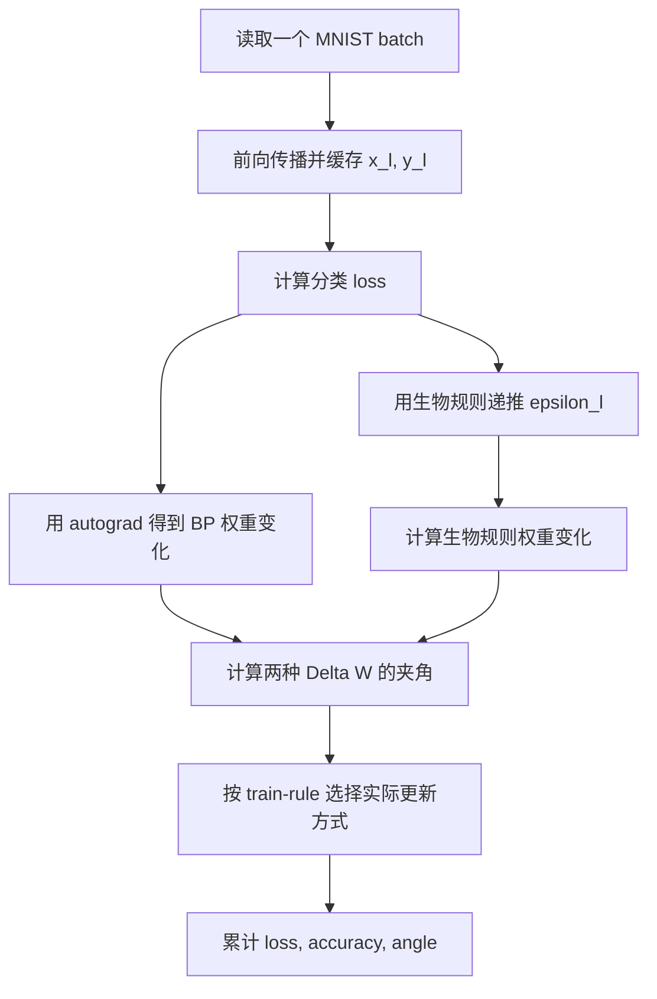

# 📐 算法实现说明


本文档解释 [Coding_prompt.tex](../Coding_prompt.tex) 中的数学公式如何映射到当前 Python 代码。

> 建议先阅读 [README](../README.md)，再阅读本文档。本文偏重公式、张量形状和实现细节。

---

## 📚 目录

- [符号约定](#-符号约定)
- [网络结构](#-网络结构)
- [正值激活函数](#-正值激活函数)
- [输出层与分类损失](#-输出层与分类损失)
- [标准 BP 权重变化](#-标准-bp-权重变化)
- [生物合理误差传播](#-生物合理误差传播)
- [截断函数 zeta](#-截断函数-zeta)
- [生物合理权重更新](#-生物合理权重更新)
- [Bias 更新](#-bias-更新)
- [权重变化夹角](#-权重变化夹角)
- [训练流程](#-训练流程)
- [代码入口](#-代码入口)
- [可扩展方向](#-可扩展方向)

---

## 🔤 符号约定

| 符号 | 代码变量 | 含义 |
| --- | --- | --- |
| `l` | `layer_index` | 层编号 |
| `x_l` | `pre_activation` | 第 `l` 层线性输入 |
| `y_l` | `activation` | 第 `l` 层激活输出 |
| `W_l` | `layer.weight` | 第 `l` 层权重矩阵 |
| `b_l` | `layer.bias` | 第 `l` 层偏置 |
| `epsilon_l` | `error` | 第 `l` 层误差信号 |
| `eta` | `learning_rate` | 学习率 |
| `Delta W_l` | `delta` | 第 `l` 层权重变化量 |

batch 张量布局：

```text
activation: [batch_size, layer_width]
weight    : [out_features, in_features]
delta     : [out_features, in_features]
```

---

## 🧱 网络结构

默认网络是一个全连接 MNIST 分类器：

```text
784 -> 500 -> 500 -> 500 -> 10
```

对应代码：

```python
model = PositiveMLP(
    input_dim=28 * 28,
    hidden_dim=500,
    output_dim=10,
    hidden_layers=3,
)
```

每层执行：

```text
x_l = W_l y_(l-1) + b_l
y_l = sigma(x_l)
```

---

## 🌱 正值激活函数

需求要求前向传播中的激活值局限在正值范围。当前实现使用：

```text
sigma(x) = softplus(x) + eps
sigma'(x) = sigmoid(x)
eps = 1e-6
```

选择 `softplus` 的原因：

| 方案 | 优点 | 风险 |
| --- | --- | --- |
| `softplus(x) + eps` | 平滑、正值、处处可导 | 大正数区域近似线性 |
| `exp(x)` | 严格正值、形式简单 | 容易数值爆炸 |
| `relu(x) + eps` | 计算简单 | `x < 0` 时导数为 0，误差传播容易中断 |

对应代码：

```python
def positive_activation(self, pre_activation):
    return F.softplus(pre_activation) + self.min_activation

def positive_activation_derivative(self, pre_activation):
    return torch.sigmoid(pre_activation)
```

文件位置：

```text
triplet_stdp_cv2_learning/model.py
```

---

## 🎯 输出层与分类损失

由于最后一层输出也经过正值激活，不能直接把 `y_L` 当成普通 logits。当前实现使用：

```text
logits = log(y_L)
loss = CrossEntropyLoss(logits, target)
```

这样做有两个好处：

1. 保留所有层激活为正的约束。
2. 仍然使用标准分类交叉熵，便于与常规深度学习实验比较。

对应代码：

```python
def logits_from_positive_output(self, output_activation):
    return torch.log(output_activation.clamp_min(self.min_activation))

def loss_from_output(self, output_activation, targets):
    logits = self.logits_from_positive_output(output_activation)
    return F.cross_entropy(logits, targets)
```

---

## 🔁 标准 BP 权重变化

标准 BP 的权重更新公式是：

```text
Delta W_l^BP = -eta * dL/dW_l
```

当前实现不手写 BP 递推，而是用 PyTorch autograd 得到精确梯度：

```python
gradients = torch.autograd.grad(loss, weights, retain_graph=True)
bp_deltas = [-learning_rate * grad for grad in gradients]
```

对应函数：

```python
bp_weight_deltas(model, loss, learning_rate)
```

这样可以确保 BP 方向是 PyTorch 对当前模型和损失函数计算出的标准方向。

---

## 🧬 生物合理误差传播

原始需求中的隐藏层误差传播公式为：

```text
epsilon_l =
  zeta(
    y_l^-1
    * sigma'(x_l)
    * W_(l+1)^T (y_(l+1) * epsilon_(l+1))
  )
```

代码中的 batch 形式是：

```python
propagated = (y_next * epsilon_next) @ W_next
raw_error = propagated * sigma_prime(x_l) / y_l
epsilon_l = zeta(raw_error)
```

矩阵方向说明：

| 数学形式 | 代码形式 | 原因 |
| --- | --- | --- |
| `W_(l+1)^T (...)` | `(...) @ W_next` | PyTorch 的 `Linear.weight` 形状是 `[out, in]` |
| `y_l^-1 * ...` | `... / y_l.clamp_min(eps)` | 避免除以 0 |
| `zeta(...)` | `zeta(raw_error)` | 把误差限制到指定区间 |

输出层误差当前取：

```text
epsilon_L = zeta(dL/dx_L)
```

对应代码：

```python
output_error = torch.autograd.grad(
    loss,
    cache.pre_activations[-1],
    retain_graph=True,
)[0]
errors[-1] = zeta(output_error, mode=scale_mode)
```

---

## ✂️ 截断函数 zeta

需求要求 `zeta` 将误差信号局限在：

```text
(-1/2, 1/2)
```

当前提供两种实现。

### tanh 模式

默认模式：

```text
zeta(x) = 0.5 * tanh(x)
```

特点：

- 平滑。
- 输出天然位于 `(-0.5, 0.5)`。
- 大误差会被连续压缩。

运行方式：

```bash
./scripts/run_experiment.sh --scale-mode tanh
```

### clamp 模式

硬截断模式：

```text
zeta(x) = clamp(x, -0.5 + eps, 0.5 - eps)
```

特点：

- 保留小误差原值。
- 大误差直接截断。
- 在截断边界不可导，但这里的生物误差传播本身以手写规则为主，不依赖对 `zeta` 求导。

运行方式：

```bash
./scripts/run_experiment.sh --scale-mode clamp
```

---

## ⚡ 生物合理权重更新

原始需求中的权重更新公式为：

```text
Delta W_l = -eta * f(epsilon_l, y_l) * y_(l-1)^T
```

batch 平均形式为：

```text
Delta W_l = -(eta / batch_size) * F_l^T @ y_(l-1)
F_l = f(epsilon_l, y_l)
```

对应代码：

```python
signal = update_signal(
    errors=error,
    activations=current_activation,
    mode=update_function,
)
delta = -(learning_rate / batch_size) * signal.T @ previous_activation
```

当前支持三种 `f(epsilon_l, y_l)`：

| 名称 | 公式 | 说明 |
| --- | --- | --- |
| `epsilon_times_activation` | `epsilon_l * y_l` | 默认值，接近需求示例 |
| `epsilon` | `epsilon_l` | 去掉活动项，观察活动门控的影响 |
| `activity_gated` | `epsilon_l * y_l / mean(y_l)` | 保留活动门控，同时做尺度归一化 |

运行示例：

```bash
./scripts/run_experiment.sh --update-function epsilon
./scripts/run_experiment.sh --update-function activity_gated
```

---

## 🧩 Bias 更新

核心对比指标只比较权重 `W_l` 的变化方向，不比较 bias。

默认训练时也不更新 bias，这样实验更贴近原始需求中的权重更新公式。若希望同时更新 bias，可以加入：

```bash
./scripts/run_experiment.sh --update-bias
```

生物规则的 bias 更新使用当前 batch 的平均信号：

```text
Delta b_l = -eta * mean(F_l, dim=batch)
```

---

## 📐 权重变化夹角

对每一层，将两个规则产生的权重变化矩阵展平成向量：

```text
theta_l = arccos(
  <Delta W_l^BP, Delta W_l^bio>
  / (||Delta W_l^BP|| * ||Delta W_l^bio||)
)
```

单位是 degree。

如果任意一方是零向量，则该层夹角记为 `None`，并且不参与平均。这样可以避免除零导致无意义数值。

CSV 输出列：

| 列名 | 含义 |
| --- | --- |
| `mean_angle_degrees` | 所有有效层夹角的平均值 |
| `layer_1_angle_degrees` | 输入层到第一隐藏层的权重夹角 |
| `layer_2_angle_degrees` | 第一隐藏层到第二隐藏层的权重夹角 |
| `layer_3_angle_degrees` | 第二隐藏层到第三隐藏层的权重夹角 |
| `layer_4_angle_degrees` | 第三隐藏层到输出层的权重夹角 |

---

## 🧭 训练流程

每个 batch 的顺序是：



重要点：

- 每个 batch 都先在同一个网络状态上计算 BP 和生物规则更新。
- 夹角比较发生在实际更新参数之前。
- `--train-rule` 只决定最后哪一种更新会真正改变模型参数。

---

## 🧰 代码入口

| 功能 | 函数或文件 |
| --- | --- |
| 网络定义 | `PositiveMLP` in `model.py` |
| 前向缓存 | `forward_with_cache` in `model.py` |
| BP 权重变化 | `bp_weight_deltas` in `learning_rules.py` |
| 生物误差传播 | `biological_errors` in `learning_rules.py` |
| 生物权重变化 | `biological_weight_deltas` in `learning_rules.py` |
| 夹角计算 | `weight_delta_angles` in `learning_rules.py` |
| MNIST 实验 | `run_experiment` in `train_mnist.py` |
| 一键脚本 | `scripts/run_experiment.sh` |

---

## 🛣️ 可扩展方向

下一步可以优先考虑：

1. 增加更多 `zeta` 函数，例如分段线性、softsign、可调温度 `tanh`。
2. 增加更多 `f(epsilon_l, y_l)`，例如高阶活动项或 triplet-STDP 风格时间迹项。
3. 同时输出权重变化范数，判断夹角变化是否伴随更新幅度塌缩。
4. 增加多随机种子实验，并绘制均值和标准差。
5. 引入测试集 accuracy，区分“方向接近 BP”和“分类性能提升”两个问题。

---

## 🔗 相关文档

- [README](../README.md)
- [费曼式介绍](feynman_intro.md)
- [实验指南](experiment_guide.md)
- [原始需求](../Coding_prompt.tex)
