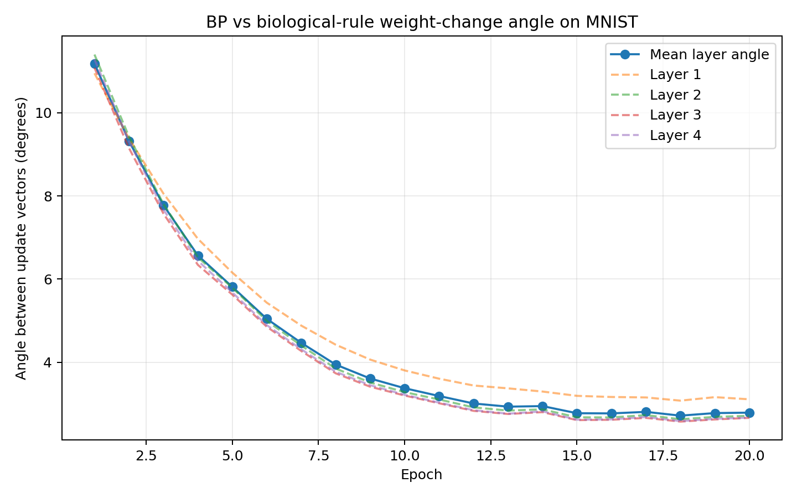

# 🧪 实验指南


本文档说明如何设计、运行和解读 `Triplet_STDP_CV2_Learning` 的实验。

> 如果你只想快速跑起来，请先看 [README](../README.md)。如果你要理解公式和实现细节，请看 [算法实现说明](algorithm_details.md)。

---

## 📚 目录

- [实验主线](#-实验主线)
- [推荐运行顺序](#-推荐运行顺序)
- [三类关键实验](#-三类关键实验)
- [参数扫描建议](#-参数扫描建议)
- [CSV 字段说明](#-csv-字段说明)
- [趋势图解读](#-趋势图解读)
- [常见问题](#-常见问题)
- [实验记录模板](#-实验记录模板)
- [后续扩展建议](#-后续扩展建议)

---

## 🧭 实验主线

项目的主线不是单纯追求 MNIST accuracy，而是比较两种权重更新方向：

```text
标准 BP 更新方向
生物合理规则更新方向
```

每个 batch 都会同时计算两种候选更新，然后统计它们之间的夹角。夹角单位是 degree。

| 夹角范围 | 直观解释 |
| --- | --- |
| `0` 度附近 | 两种规则给出的方向几乎一致 |
| `90` 度附近 | 两种规则近似正交，方向关系弱 |
| `180` 度附近 | 两种规则方向相反 |

---

## 🚀 推荐运行顺序

### Step 1: 确认环境和代码正常

```bash
./scripts/run_experiment.sh --smoke
```

这一步使用很少样本，目的是确认：

- 依赖可用。
- MNIST 能下载或读取。
- 单元测试通过。
- 训练入口能生成 CSV 和图片。

### Step 2: 跑一个中等规模实验

```bash
./scripts/run_experiment.sh --quick
```

这一步适合快速观察输出格式和初步趋势。

### Step 3: 跑正式实验

```bash
./scripts/run_experiment.sh --epochs 20 --open
```

如果机器较慢，可以先用：

```bash
./scripts/run_experiment.sh --epochs 5
```

---

## 🧪 三类关键实验

### 1. 生物规则训练

```bash
./scripts/run_experiment.sh \
  --epochs 20 \
  --train-rule biological \
  --output-csv outputs/biological_metrics.csv \
  --output-plot outputs/biological_angle_trend.png
```

问题：

> 当网络真的由生物规则训练时，它产生的更新方向是否越来越接近 BP？

重点看：

- `mean_angle_degrees` 是否下降。
- loss 是否下降。
- accuracy 是否上升。

### 2. BP 训练

```bash
./scripts/run_experiment.sh \
  --epochs 20 \
  --train-rule bp \
  --output-csv outputs/bp_metrics.csv \
  --output-plot outputs/bp_angle_trend.png
```

问题：

> 在标准 BP 的参数轨迹上，生物规则是否能近似 BP 的更新方向？

这个实验更像是“方向逼近测试”。

### 3. 初始状态方向比较

```bash
./scripts/run_experiment.sh \
  --epochs 1 \
  --train-rule none \
  --output-csv outputs/initial_metrics.csv \
  --output-plot outputs/initial_angle_trend.png
```

问题：

> 在随机初始化附近，两种规则的更新方向天然有多接近？

---

## 🎛️ 参数扫描建议

可以围绕两个核心函数做扫描。

### 扫描 zeta

```bash
./scripts/run_experiment.sh --scale-mode tanh  --output-plot outputs/zeta_tanh.png
./scripts/run_experiment.sh --scale-mode clamp --output-plot outputs/zeta_clamp.png
```

比较点：

- `tanh` 是否更稳定。
- `clamp` 是否保留更多小误差信息。
- 哪种方式让夹角更小，或者让 loss 更快下降。

### 扫描 f(epsilon, y)

```bash
./scripts/run_experiment.sh \
  --update-function epsilon_times_activation \
  --output-plot outputs/f_epsilon_times_activation.png

./scripts/run_experiment.sh \
  --update-function epsilon \
  --output-plot outputs/f_epsilon.png

./scripts/run_experiment.sh \
  --update-function activity_gated \
  --output-plot outputs/f_activity_gated.png
```

比较点：

- 活动项 `y_l` 是否改善方向一致性。
- 活动归一化是否能减少层间尺度差异。
- 哪个函数带来更好的 accuracy。

---

## 📄 CSV 字段说明

示例输出：

```csv
epoch,train_loss,train_accuracy,mean_angle_degrees,layer_1_angle_degrees,layer_2_angle_degrees,layer_3_angle_degrees,layer_4_angle_degrees
1,2.3060,0.1250,8.585,...
```

字段解释：

| 字段 | 解释 |
| --- | --- |
| `epoch` | 第几个 epoch |
| `train_loss` | 当前 epoch 的平均训练损失 |
| `train_accuracy` | 当前 epoch 的平均训练准确率 |
| `mean_angle_degrees` | 所有有效层夹角的平均值 |
| `layer_1_angle_degrees` | 输入层到第一隐藏层的权重更新夹角 |
| `layer_2_angle_degrees` | 第一隐藏层到第二隐藏层的权重更新夹角 |
| `layer_3_angle_degrees` | 第二隐藏层到第三隐藏层的权重更新夹角 |
| `layer_4_angle_degrees` | 第三隐藏层到输出层的权重更新夹角 |

---

## 📈 趋势图解读

示例趋势图：



这张示例图来自一次 20 epoch 实验。可以看到平均夹角从较高值逐步下降到较低值，说明在该设置下，生物规则产生的权重更新方向逐渐接近 BP 更新方向。

趋势图中通常有两类线：

| 曲线 | 含义 |
| --- | --- |
| `Mean layer angle` | 所有层夹角的平均值 |
| `Layer 1` 到 `Layer 4` | 每层单独的夹角 |

建议观察四件事：

1. 平均夹角是否整体下降。
2. 某一层是否始终明显偏大。
3. loss 下降时，夹角是否也下降。
4. 生物规则训练和 BP 训练的曲线形状是否相似。

可能出现的现象：

| 现象 | 可能含义 |
| --- | --- |
| 夹角下降，accuracy 上升 | 生物规则方向逐渐接近有效梯度方向 |
| 夹角下降，accuracy 不上升 | 方向接近不一定带来足够更新幅度或合适尺度 |
| 夹角不下降，accuracy 上升 | 生物规则可能找到不同于 BP 的有效方向 |
| 某层夹角异常大 | 该层的误差传播或活动尺度可能需要单独分析 |

---

## ❓ 常见问题

### 为什么项目名大写，代码目录小写？

这是 Python 项目的常见做法：

```text
仓库名: Triplet_STDP_CV2_Learning
包名  : triplet_stdp_cv2_learning
```

仓库名用于展示和组织；包名用于 Python import。小写下划线更符合 Python 生态习惯。

### 为什么要固定 `numpy<2`？

当前依赖中的 PyTorch 版本是 `torch==2.2.2`。这个版本的二进制包与 NumPy 2.x 的 ABI 不完全兼容，可能导致 `RuntimeError: Numpy is not available`。因此 `requirements.txt` 使用：

```text
numpy<2
```

### 为什么输出层也使用正值激活？

原始需求要求前向传播激活值局限在正值范围。为了让所有层都满足这个约束，输出层也使用 `softplus + eps`。分类时再使用 `log(y_L)` 作为 logits。

### 为什么默认不更新 bias？

原始公式主要描述权重更新：

```text
Delta W_l = -eta * f(epsilon_l, y_l) * y_(l-1)^T
```

因此默认只更新权重。需要更新 bias 时可添加：

```bash
./scripts/run_experiment.sh --update-bias
```

---

## 📝 实验记录模板

每次实验建议记录：

```text
日期:
命令:
随机种子:
train-rule:
scale-mode:
update-function:
epochs:
输出 CSV:
输出图片:
主要观察:
下一步:
```

示例：

```text
日期: 2026-05-24
命令: ./scripts/run_experiment.sh --epochs 20 --train-rule biological
随机种子: 1234
train-rule: biological
scale-mode: tanh
update-function: epsilon_times_activation
epochs: 20
输出 CSV: outputs/angle_metrics.csv
输出图片: outputs/angle_trend.png
主要观察: mean_angle_degrees 在前几个 epoch 是否下降
下一步: 对比 --train-rule bp
```

---

## 🛣️ 后续扩展建议

短期优先级：

1. 增加 test accuracy。
2. 增加多随机种子平均曲线。
3. 输出每层更新范数，和夹角一起分析。
4. 把不同实验的曲线合并到一张图里。

中期优先级：

1. 增加更多 `zeta` 函数。
2. 增加 triplet-STDP 风格的时间迹变量。
3. 对比不同正值激活函数。
4. 在 Fashion-MNIST 或 CIFAR-10 上验证趋势是否保留。

---

## 🔗 相关文档

- [README](../README.md)
- [费曼式介绍](feynman_intro.md)
- [算法实现说明](algorithm_details.md)
- [原始需求](../Coding_prompt.tex)
